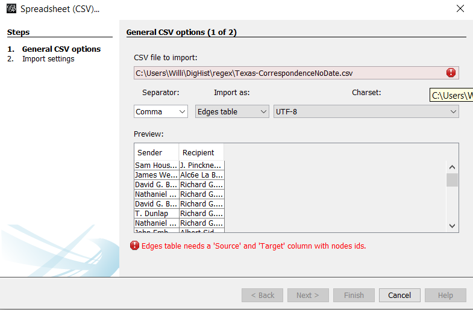

# Week Three Notes

### Unrelated 
but finally figured out how to install ffmpeg for the Week 2 Bonus/for personal reasons. Turns out I had to rename the folder to ffmpeg, move it to my Windows folder, and then add it to the Environment Variables Path. I was able to use it to download a youtube video as well as the audio so that I could share it with other people in the event that the original was taken down(which it later was). It felt good to be able to share the video with people that had waited to watch it.

## Regex

As people at the beginning of the week had errors using the powershell in Anaconda to create the texas.txt file, I wanted to test it to see if I could reproduce the error. I did and ended up having it create the blank .txt file as well as have the program hang and not allow me to enter new commands. So then I followed the suggested route and used the Windows Command Prompt instead which worked as expected.

Honestly I thought I understood how the search terms were built, and why they would find what they did but after attempting to clean the text file multiple time which resulted in files that were unclean. After getting frustrated with it, I dropped it for now since I was not making any progress.

Re-read the instructions page and did everything in the same order (I believe) as before and ended up with what appears to be the expected outcome.

### Search terms used / description

> (.+\<to\>) replapce with ~\1 - Searches for all lines with to in it to indicate data, then adds a tilde before it to id it as useful

> \n[^~]+ replace with \n - Searches for any line without a tilde and deletes it

> (,)( [0-9]{4})(.+) replace with \2 - Transforms the dates and removes the page numbers

> (\b to \b) replace with , - Replaces the to between the sender and recipient with a comma

> .+,.+,.+, - Searches for lines with more than two commas so we can manually clean the data to save this as a .csv

## Open Refine

Used various methods and weights to clean the data by amalgamizing the various spellings of names into one name.

## Networks

### Palladio

Databasic was having Server 500 issues still, so I used palladio but that did not seem to work as well or as smooth as the previews of databasic appeared.

### Gephi

Had to edit the gephi.conf file to ensure that gephi worked

> jdkhome="C:\Program Files (x86)\Java\jre1.8.0_251" 

Encountered an error when trying to load my cleaned .csv

After scouring the internet to find a solution, all I found is to save it as a UTF-8 withouth BOM which I already was doing. So I loaded the .csv provided in the instructions which worked fine despite appearing quite similar to my own.

Followed the instructions and played around with the different layouts to see the varying results. Mainly only utilized the recommended settings, would like to go back and see what everything does.

My final preview/outputs definitely need more work though

[GephiTestPreview](GephiTestPreview.pdf)

I did figure out how to add a background colour though!
